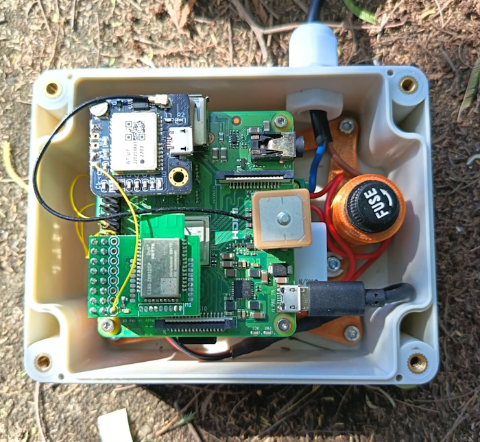

# GridFreqMonitor
This project configures a Raspberry Pi to measure the electrical grid frequency (50 Hz) in real-time and streams the data via MQTT. Written in Python, it enables live monitoring of power grid stability and frequency variations for analysis or integration with other systems.

# Operating Principle
The circuit used to measure the grid frequency is based on a [mains module](https://fr.aliexpress.com/item/32828199766.htm), with a small modification. The modification involves removing the smoothing capacitor, which results in a 100 Hz signal being sent to the optocoupler (a pulse at each zero crossing).

This frequency is then compared to a 1 Hz reference signal obtained from the PPS signal of a GPS [GT-U7](https://fr.aliexpress.com/item/32832919409.html) module (based on an atomic clock). To achieve this, the number of pulses from the 100 Hz signal is counted during 10 pulses of the 1 Hz signal (i.e., over 10 seconds). 

The grid frequency value is calculated by dividing the 100 Hz signal by 2 and averaging it over 10 seconds. The frequency is updated every second using a sliding average.

## Features
- Measures 100Hz input pulses and averages over 10 seconds.
- Sends grid frequency data every second over MQTT.
- Runs as a systemd service on Raspberry Pi.
- Uses a Python virtual environment for dependencies.
- Script uses `pigpiod` to manage GPIO.

## Setup Instructions

Follow these steps to set up the `GridFreqMonitor` project on your Raspberry Pi:

1. **Install Mosquitto MQTT Broker**:
   ```bash
   sudo apt update
   sudo apt install mosquitto mosquitto-clients
   sudo systemctl enable mosquitto
   sudo systemctl start mosquitto
   ```

   Verify that Mosquitto is running:
   ```bash
   sudo systemctl status mosquitto
   ```

   Optionally, if you need to allow local anonymous connections for this project (or if the service cannot connect), add the following lines to `/etc/mosquitto/mosquitto.conf` with these contents:

   ```
   # Allow local anonymous connections for GridFreqMonitor
   listener 1883 127.0.0.1
   allow_anonymous true
   ```

   Then restart Mosquitto:
   ```bash
   sudo systemctl restart mosquitto
   ```

2. **Copy Files**: Copy all project files to your Raspberry Pi user's home directory (e.g., `/home/pi/grid_freq_monitor/`).

3. **Make the Setup Script Executable**: 
   ```bash
   chmod +x setup_and_run.sh
   ```

4. **Configure sudo for pigpiod**: To allow the service to start the `pigpiod` daemon without requiring a password:
   - Open the `sudoers` file for editing:
     ```bash
     sudo visudo
     ```
   - Add the following line at the end of the file:
     ```plaintext
     pi ALL=(ALL) NOPASSWD: /usr/bin/pigpiod
     ```
   - Save and exit the editor. If you are using `nano` (default editor for `visudo`), press `Ctrl+O` to save and `Ctrl+X` to exit.
   - Verify the configuration by running:
     ```bash
     sudo pigpiod
     ```
     If the command runs without asking for a password, the configuration is correct.

5. **Enable and Start the Systemd Service**:
   ```bash
   sudo cp grid_freq_monitor.service /etc/systemd/system/
   sudo systemctl daemon-reload
   sudo systemctl enable grid_freq_monitor.service
   sudo systemctl start grid_freq_monitor.service
   ```

6. **Check Service Status and Logs**:
   ```bash
   sudo systemctl status grid_freq_monitor.service
   journalctl -u grid_freq_monitor.service -f
   ```

## Usage
- The service will start automatically at boot.
- The frequency data is published to the MQTT topic `grid/frequency` on the local Mosquitto broker.
- You can subscribe to the topic using the following command:
   ```bash
   mosquitto_sub -h localhost -t "grid/frequency" -v
   ```

   Example JSON message:
   ```json
   {
       "time_stamp": 1690000000.123456,
       "last_update_time": 1690000000.123456,
       "frequency": 50.480
   }
   ```

## Notes
- Update user `pi` if necessary (update `grid_freq_monitor.service` file).
- Update Linux script by command `dos2unix` if necessary.  
- Make sure `pigpiod` and `mosquitto` daemons are running (the service starts them if needed).
- GPIO pins 21 and 24 must be connected to your frequency sources.
- Modify GPIO pin numbers and other parameters in `grid_freq_monitor.py` if necessary.
- Disable `print()` in release for better performance.

## Example Implementation

Below is a typical implementation of the GridFreqMonitor system using the Raspberry Pi, mains signal detection circuit, and GPS PPS reference.



## Reference
- https://www.swissgrid.ch/en/home/operation/grid-data/current-data.html#frequency
- https://oinkzwurgl.org/projaeggd/mains-frequency/
- https://revspace.nl/MainsFrequency
- https://mainsfrequency.com/impressum.htm

## License
MIT License.
